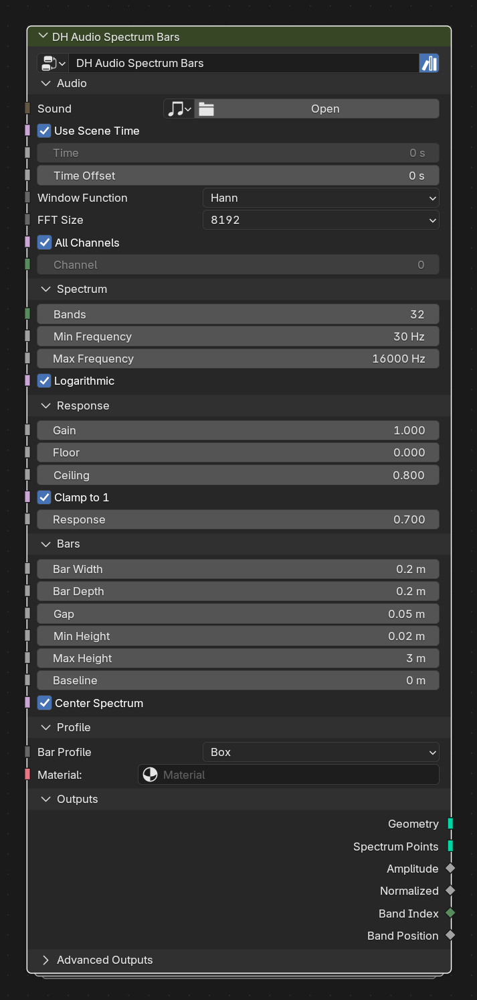
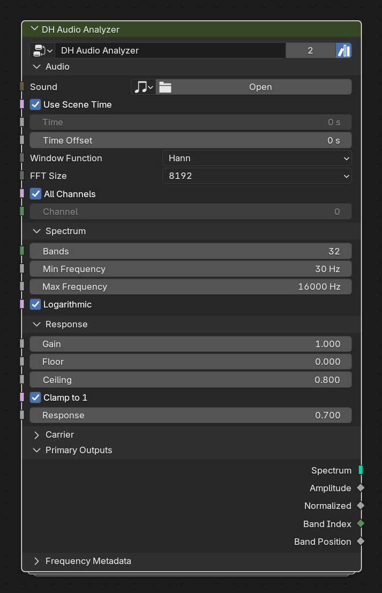
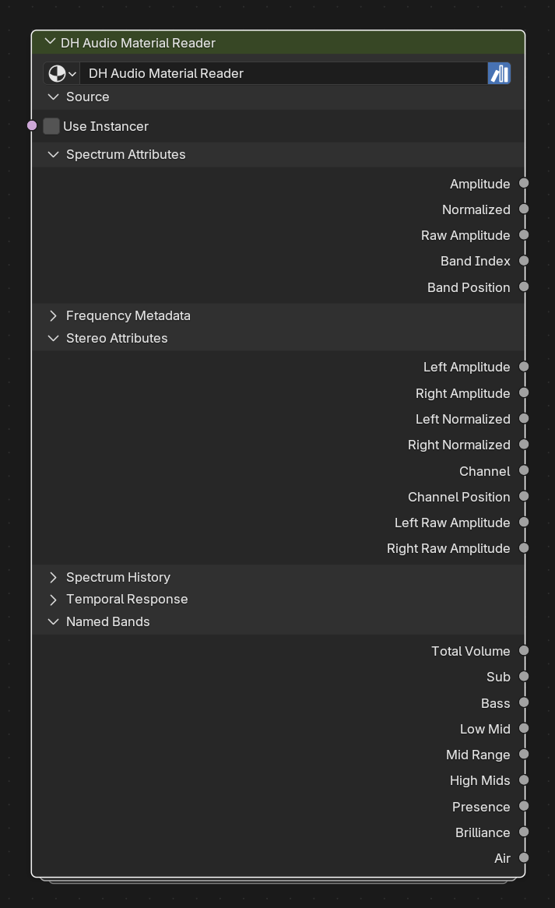
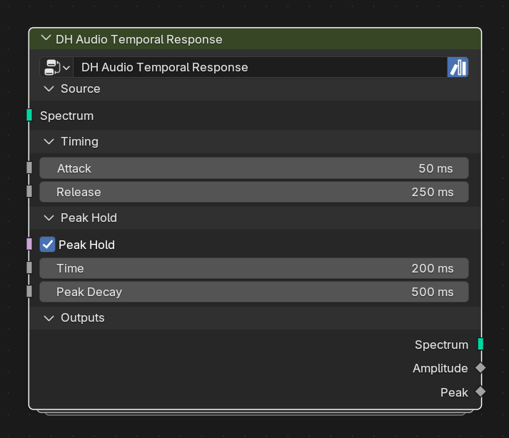
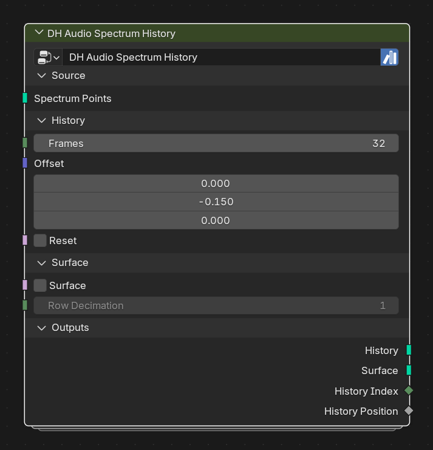

# DH Audio Toolkit

**Audio-reactive Geometry Nodes and Shader Nodes for Blender 5.2+**

**Current release:** [3.13.0](https://github.com/dayhawk-labs/DH-Audio-Toolkit/releases/tag/v3.13.0)
**Public assets:** 25 node groups · **Internal groups:** 7 implementation-only groups

DH Audio Toolkit turns Blender's Sample Sound Frequencies node into a stable
audio-data pipeline: analyze once, carry standard attributes through geometry,
then visualize, deform, query, or read them in materials.

> **Compatibility:** public group names and `dh_audio_*` attributes are
> compatibility-sensitive. GitHub `main` is the development source of truth;
> releases are the portable Asset Library install.

## Install and first result

1. Download `DH-Audio-Toolkit-3.13.0.zip` from
   [GitHub Releases](https://github.com/dayhawk-labs/DH-Audio-Toolkit/releases).
2. Extract the complete `DH Audio Toolkit 3.13.0` folder and add it as a
   Blender Asset Library.
3. In the Asset Browser, browse **DH Audio** and drag a group into Geometry
   Nodes or the Shader Editor.
4. For a fast visualizer, add
   [Spectrum Bars](docs/nodes/spectrum_bars.md). For a modular workflow, start
   with [Analyzer](docs/nodes/analyzer.md) → [Spectrum Points](docs/nodes/spectrum_points.md).

The [asset-library installation guide](docs/ASSET_LIBRARY_INSTALL.md) has the
full Blender setup. The [recipe guide](docs/RECIPES.md) has complete workflows.
For a complete stateful build, start with the
[Peak-Hold Waterfall Surface recipe](docs/recipes/peak_hold_waterfall.md).

## Choose a workflow

~~~text
Analyzer / Stereo Analyzer
  ├─ Spectrum Points / Stereo Points
  │    ├─ Spectrum Curve / Fill
  │    ├─ Spectrum History (waterfall or Surface)
  │    ├─ Radial Spectrum
  │    └─ custom geometry
  ├─ Temporal Response (live smoothing + Peak)
  ├─ Band Query / Spectrum Sample
  └─ Spectrum Bridge / Mesh Deform / Mesh Extrude

Geometry attributes → Material Reader → Shader Response / Map / UV Transform
~~~

| Fastest starting point | Modular geometry pipeline | Material pipeline |
| --- | --- | --- |
| [Spectrum Bars](docs/nodes/spectrum_bars.md) has its own analyzer and outputs geometry plus Spectrum Points. | [Analyzer](docs/nodes/analyzer.md) writes the standard carrier; [Spectrum Points](docs/nodes/spectrum_points.md) positions it. | [Material Reader](docs/nodes/material_reader.md) exposes the shared attributes to shader groups. |
|  |  |  |

### Time-aware controls

[Temporal Response](docs/nodes/temporal_response.md) is the stateful option for
attack/release smoothing and a separate Peak Hold marker. Its key controls are
open by default: `dh_audio_amp` remains the live response and
`dh_audio_peak` is the held/decaying marker.
[Spectrum History](docs/nodes/spectrum_history.md) retains prior rows and can
optionally emit a connected waterfall Surface; its Surface controls are open by
default while the Surface itself stays disabled.

| Temporal Response | Spectrum History |
| --- | --- |
|  |  |

Both use Simulation Zones. Play sequentially or bake before expecting complete
temporal behavior or historical rows.

## Public node reference

Every public asset has a page with a current exterior-node screenshot, verified
socket descriptions/defaults, panel state, and concise agent workflow notes:

**[Browse the 25-node public reference](docs/nodes/README.md)**

### Analysis

- **DH Audio Analyzer** — [reference](docs/nodes/analyzer.md)
- **DH Audio Stereo Analyzer** — [reference](docs/nodes/stereo_analyzer.md)
- **DH Audio Bands** — [reference](docs/nodes/bands.md)
- **DH Audio Sample Range** — [reference](docs/nodes/sample_range.md)

### Query and utilities

- **DH Audio Band Query** — [reference](docs/nodes/band_query.md)
- **DH Audio Spectrum Sample** — [reference](docs/nodes/spectrum_sample.md)
- **DH Audio Frequency Map** — [reference](docs/nodes/frequency_map.md)
- **DH Audio Frequency Selection** — [reference](docs/nodes/frequency_selection.md)
- **DH Audio Response** — [reference](docs/nodes/response.md)

### Mapping and transport

- **DH Audio Spectrum Points** — [reference](docs/nodes/spectrum_points.md)
- **DH Audio Stereo Points** — [reference](docs/nodes/stereo_points.md)
- **DH Audio Spectrum Bridge** — [reference](docs/nodes/spectrum_bridge.md)
- **DH Audio Mesh Deform** — [reference](docs/nodes/mesh_deform.md)
- **DH Audio Mesh Extrude** — [reference](docs/nodes/mesh_extrude.md)
- **DH Audio Radial Spectrum** — [reference](docs/nodes/radial_spectrum.md)

### Visualizers and temporal

- **DH Audio Spectrum Bars** — [reference](docs/nodes/spectrum_bars.md)
- **DH Audio Spectrum Curve** — [reference](docs/nodes/spectrum_curve.md)
- **DH Audio Spectrum Fill** — [reference](docs/nodes/spectrum_fill.md)
- **DH Audio Spectrum Instances** — [reference](docs/nodes/spectrum_instances.md)
- **DH Audio Spectrum History** — [reference](docs/nodes/spectrum_history.md)
- **DH Audio Temporal Response** — [reference](docs/nodes/temporal_response.md)

### Shader nodes

- **DH Audio Material Reader** — [reference](docs/nodes/material_reader.md)
- **DH Audio Shader Response** — [reference](docs/nodes/shader_response.md)
- **DH Audio Shader Map** — [reference](docs/nodes/shader_map.md)
- **DH Audio Shader UV Transform** — [reference](docs/nodes/shader_uv_transform.md)

## Shared attribute contract

The standard schema makes analyzer-compatible groups composable:

- **Spectrum:** `dh_audio_amp`, `dh_audio_norm`, `dh_audio_raw`,
  `dh_audio_band_index`, `dh_audio_band_pos`, `dh_audio_low_hz`,
  `dh_audio_center_hz`, `dh_audio_high_hz`, `dh_audio_bandwidth_hz`
- **Temporal:** `dh_audio_peak` alongside the live `dh_audio_amp`
- **Stereo:** `dh_audio_channel`, `dh_audio_channel_pos`,
  `dh_audio_left_amp`, `dh_audio_right_amp`, `dh_audio_left_norm`,
  `dh_audio_right_norm`, `dh_audio_left_raw`, `dh_audio_right_raw`
- **History:** `dh_audio_history_index`, `dh_audio_history_pos`
- **Named bands:** `dh_audio_total`, `dh_audio_sub`, `dh_audio_bass`,
  `dh_audio_low_mid`, `dh_audio_mid`, `dh_audio_high_mids`,
  `dh_audio_presence`, `dh_audio_brilliance`, `dh_audio_air`

## Documentation and development

| Need | Start here |
| --- | --- |
| Build a result | [Recipes and examples](docs/RECIPES.md) |
| Install the released asset | [Asset Library install](docs/ASSET_LIBRARY_INSTALL.md) |
| Inspect an exact public interface | [Public Node Reference](docs/nodes/README.md) |
| Change the toolkit safely | [Agent Guide](docs/AGENT_GUIDE.md) |
| Regenerate reviewed node screenshots | [Node preview process](docs/NODE_PREVIEWS.md) |
| Verify behavior | [Blender regression](tests/blender_52_regression.py) |
| Review changes/releases | [Validation guide](docs/VALIDATION.md) |
| Plan the next increment | [Next steps](docs/NEXT_STEPS.md) |

The generator, tests, and documentation tools are development resources; end
users only need the released Asset Library folder.

## Asset catalogs

Assets are cataloged under:

~~~text
Geometry Nodes / DH Audio / Analysis
Geometry Nodes / DH Audio / Mapping
Geometry Nodes / DH Audio / Query
Geometry Nodes / DH Audio / Visualizers
Geometry Nodes / DH Audio / Utilities
DH Audio / Shaders
~~~

Keep `blender_assets.cats.txt` beside the released `.blend` when moving an
Asset Library. Its catalog UUIDs are intentionally stable.

## Design notes

- Larger FFT sizes improve frequency precision but respond more slowly.
- The stock ceiling is `0.8`, avoiding clipping on ordinary mastered music.
- Smooth curves use Catmull–Rom interpolation; Smooth + Resample produces
  evenly sampled topology.
- Public groups hide repetitive attribute plumbing; the public reference shows
  only their intended exterior interfaces.
