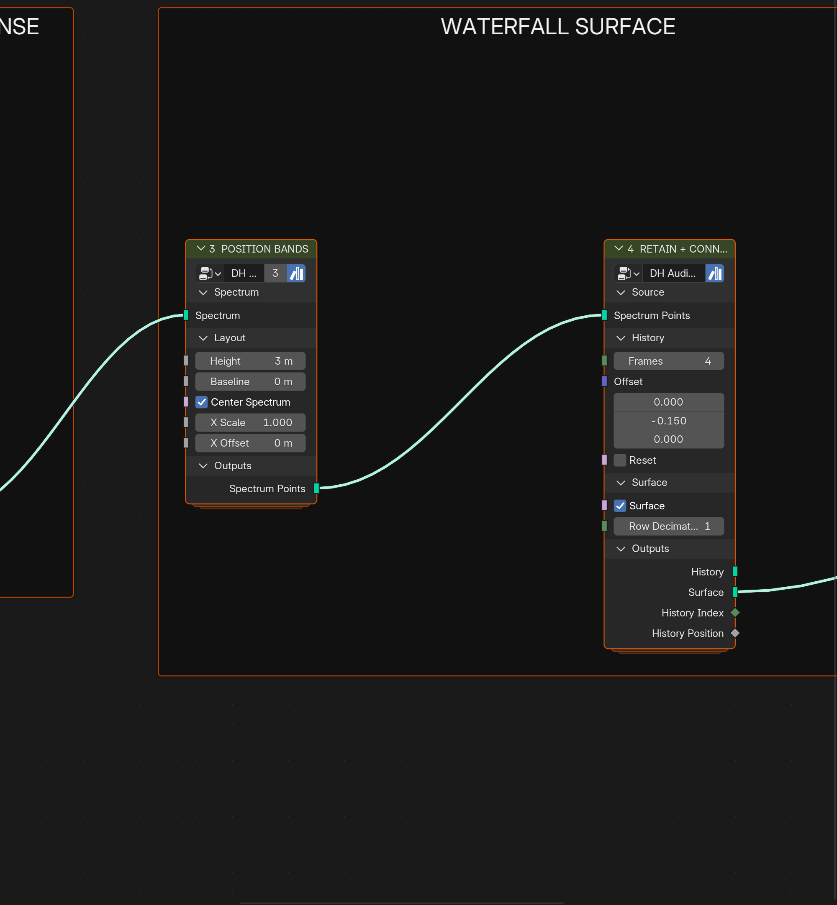
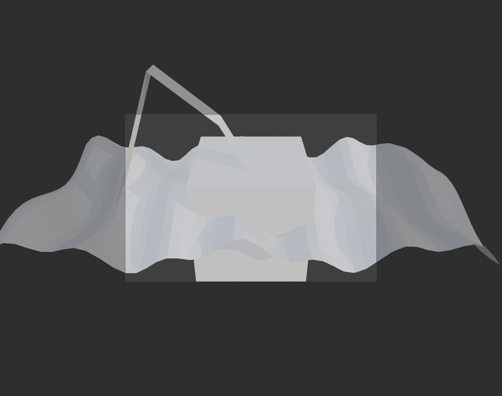
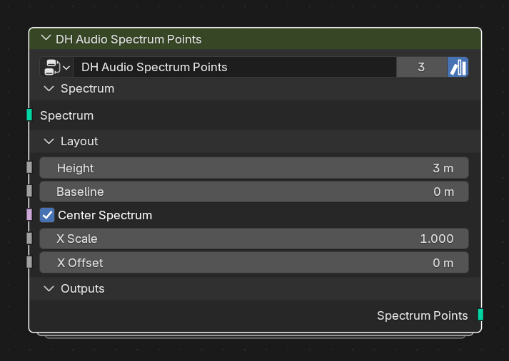

# Demo files

## Peak-Hold Waterfall Demo

[Download the demo blend](DH%20Audio%20Toolkit%20Peak%20Hold%20Waterfall%20Demo.blend)

Open in Blender 5.2+ and play from frame 1. The file includes a short synthetic
Sound datablock packed into the file and assigned to the Analyzer, so the demo
is immediately playable. Replace it with your own Sound if desired. The file
also includes a camera, lights, and material applied by the actual Geometry
Nodes chain for a quick viewport/render check.

The verified Analyzer → Temporal Response → Spectrum Points → Spectrum History
Surface workflow has labeled stages and an in-file usage note. Simulation Zones
still need sequential playback or baking before judging the final animation.

### Wiring and result

The labeled external wiring from the demo file. The current committed capture is
an **incomplete overview**: its left side clips the Analyzer and Temporal
Response stages. Use the `.blend` for the authoritative full graph until the
capture is regenerated.

An actual Blender viewport capture of the evaluated Geometry Nodes result at
frame 4. Open the demo and play sequentially from frame 1 (or bake) before
evaluating a later frame; the node chain applies the waterfall material and
produces the surface shown here.

### Individual node captures

These are the public node exteriors used by the demo, captured from Blender 5.2
at documentation scale:

| Stage | Node |
| --- | --- |
| Analyze |  |
| Smooth and peak |  |
| Position bands |  |
| Retain and connect |  |

The `.blend` contains the labeled node-tree layout and the preview scene;
open it in Blender to inspect the complete wiring and viewport setup.

### Capture notes

The current viewport image is an evaluation/debug capture, not a polished
showcase render. Known issues are recorded in
[CAPTURE_NOTES.md](CAPTURE_NOTES.md): the default cube remains in the scene,
the camera passepartout is visible, and a geometry artifact is present. These
are intentionally documented before the next capture pass.

Rebuild it with `tools/create_peak_hold_waterfall_demo.py` if the toolkit
interface changes.
