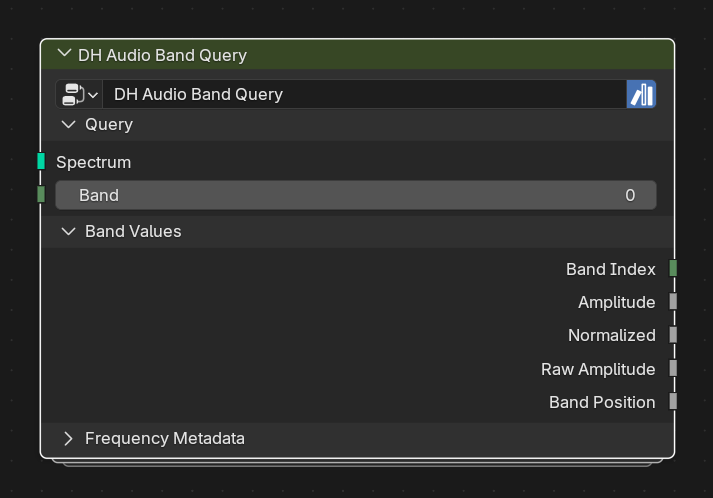

# DH Audio Band Query

**Category:** Query 
**Blender domain:** GeometryNodeTree 
**Default node width:** 285 px

Retrieve one spectrum band's amplitude and frequency metadata from DH Audio Analyzer.

## Agent notes

- Band is zero-based and clamps safely to the available range.
- Use Spectrum Sample instead when Band must vary per point, face, curve point, or instance.

## Interface panels

- **Query**: open by default; Retrieve one indexed band from DH Audio Analyzer carrier geometry
- **Band Values**: open by default; Common scalar values from the selected band
- **Frequency Metadata**: collapsed by default; Detailed frequency bounds for the selected band

## Inputs

| Panel | Socket | Type | Default | Description |
| --- | --- | --- | --- | --- |
| Query | **Spectrum** | NodeSocketGeometry | none | Carrier geometry from DH Audio Analyzer |
| Query | **Band** | NodeSocketInt | 0 | Zero-based band index. Out-of-range values clamp to the nearest valid band |

## Outputs

| Panel | Socket | Type | Default | Description |
| --- | --- | --- | --- | --- |
| Band Values | **Band Index** | NodeSocketInt | 0 | none |
| Band Values | **Amplitude** | NodeSocketFloat | 0 | none |
| Band Values | **Normalized** | NodeSocketFloat | 0 | none |
| Band Values | **Raw Amplitude** | NodeSocketFloat | 0 | none |
| Band Values | **Band Position** | NodeSocketFloat | 0 | none |
| Frequency Metadata | **Low Frequency** | NodeSocketFloat | 0 | none |
| Frequency Metadata | **Center Frequency** | NodeSocketFloat | 0 | none |
| Frequency Metadata | **High Frequency** | NodeSocketFloat | 0 | none |
| Frequency Metadata | **Bandwidth** | NodeSocketFloat | 0 | none |

## Verification source

This page was generated from the public Blender interface exported by
tools/export_public_node_interfaces.py against a fresh toolkit build. Update
the screenshot and regenerate this page whenever the public interface changes.
