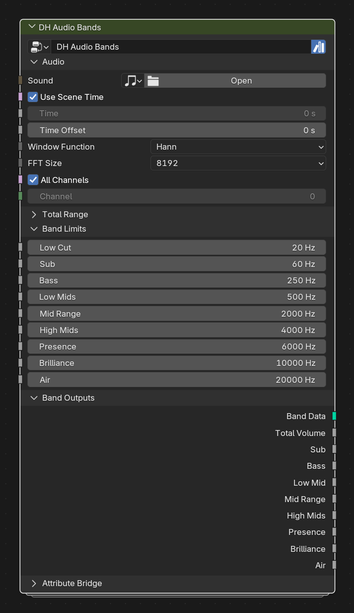

# DH Audio Bands

**Category:** Analysis 
**Blender domain:** GeometryNodeTree 
**Default node width:** 330 px

Named musical frequency bands independent of spectrum band count. Uses one field-driven audio sampler, a compact indexed band mapper, direct scalar outputs, Band Data carrier geometry, and an integrated attribute bridge.

## Agent notes

- Use named musical ranges when fixed musical regions are clearer than arbitrary band indices.
- Use its attribute bridge when values must survive into geometry or materials; use direct outputs for immediate fields.

## Key choices

- **Window Function** and **FFT Size** use Blender 5.2's native Sample Sound Frequencies menus; their defaults are Hann and 8192.

## Interface panels

- **Audio**: open by default; Sound, time, channel and FFT controls shared by all named bands
- **Total Range**: collapsed by default; Independent frequency range for Total Volume
- **Band Limits**: open by default; Editable contiguous boundaries for named musical bands
- **Band Outputs**: open by default; Direct scalar amplitude values plus the nine-point named-band carrier
- **Attribute Bridge**: collapsed by default; Optionally stamp all named-band values onto arbitrary geometry

## Inputs

| Panel | Socket | Type | Default | Description |
| --- | --- | --- | --- | --- |
| Audio | **Sound** | NodeSocketSound | none | Required: Sound data-block to analyze. An unassigned Sound produces zero amplitude, which is indistinguishable from silent audio inside Geometry Nodes |
| Audio | **Use Scene Time** | NodeSocketBool | on | Use Scene Time. Disable to use the custom Time input |
| Audio | **Time** | NodeSocketFloat | 0 | Custom time in seconds when Use Scene Time is disabled |
| Audio | **Time Offset** | NodeSocketFloat | 0 | Seconds added to the selected time source |
| Audio | **Window Function** | NodeSocketMenu | Hann | FFT window function |
| Audio | **FFT Size** | NodeSocketMenu | 8192 | FFT analysis size. Higher values improve frequency resolution but reduce time resolution |
| Audio | **All Channels** | NodeSocketBool | on | Mix all channels before sampling |
| Audio | **Channel** | NodeSocketInt | 0 | Channel used when All Channels is disabled |
| Total Range | **Total Low** | NodeSocketFloat | 20 | Lower bound for Total Volume |
| Total Range | **Total High** | NodeSocketFloat | 2e+04 | Upper bound for Total Volume |
| Band Limits | **Low Cut** | NodeSocketFloat | 20 | Lowest frequency included in Sub |
| Band Limits | **Sub** | NodeSocketFloat | 60 | Upper boundary of Sub |
| Band Limits | **Bass** | NodeSocketFloat | 250 | Upper boundary of Bass |
| Band Limits | **Low Mids** | NodeSocketFloat | 500 | Upper boundary of Low Mid |
| Band Limits | **Mid Range** | NodeSocketFloat | 2000 | Upper boundary of Mid Range |
| Band Limits | **High Mids** | NodeSocketFloat | 4000 | Upper boundary of High Mids |
| Band Limits | **Presence** | NodeSocketFloat | 6000 | Upper boundary of Presence |
| Band Limits | **Brilliance** | NodeSocketFloat | 1e+04 | Upper boundary of Brilliance |
| Band Limits | **Air** | NodeSocketFloat | 2e+04 | Upper boundary of Air |
| Attribute Bridge | **Geometry** | NodeSocketGeometry | none | Optional geometry that should receive all named-band attributes |
| Attribute Bridge | **Store on Points** | NodeSocketBool | on | Write dh_audio_total/sub/bass/etc. on the point domain |
| Attribute Bridge | **Store on Instances** | NodeSocketBool | on | Write dh_audio_total/sub/bass/etc. on the instance domain |

## Outputs

| Panel | Socket | Type | Default | Description |
| --- | --- | --- | --- | --- |
| Band Outputs | **Band Data** | NodeSocketGeometry | none | Nine-point carrier, one point per named range. Carries point-specific dh_audio_named_* metadata plus every global dh_audio_sub/bass/etc. value. |
| Band Outputs | **Total Volume** | NodeSocketFloat | 0 | Raw summed amplitude for Total Volume |
| Band Outputs | **Sub** | NodeSocketFloat | 0 | Raw summed amplitude for Sub |
| Band Outputs | **Bass** | NodeSocketFloat | 0 | Raw summed amplitude for Bass |
| Band Outputs | **Low Mid** | NodeSocketFloat | 0 | Raw summed amplitude for Low Mid |
| Band Outputs | **Mid Range** | NodeSocketFloat | 0 | Raw summed amplitude for Mid Range |
| Band Outputs | **High Mids** | NodeSocketFloat | 0 | Raw summed amplitude for High Mids |
| Band Outputs | **Presence** | NodeSocketFloat | 0 | Raw summed amplitude for Presence |
| Band Outputs | **Brilliance** | NodeSocketFloat | 0 | Raw summed amplitude for Brilliance |
| Band Outputs | **Air** | NodeSocketFloat | 0 | Raw summed amplitude for Air |
| Attribute Bridge | **Geometry** | NodeSocketGeometry | none | Input Geometry with the named-band attribute set attached |

## Verification source

This page was generated from the public Blender interface exported by
tools/export_public_node_interfaces.py against a fresh toolkit build. Update
the screenshot and regenerate this page whenever the public interface changes.
