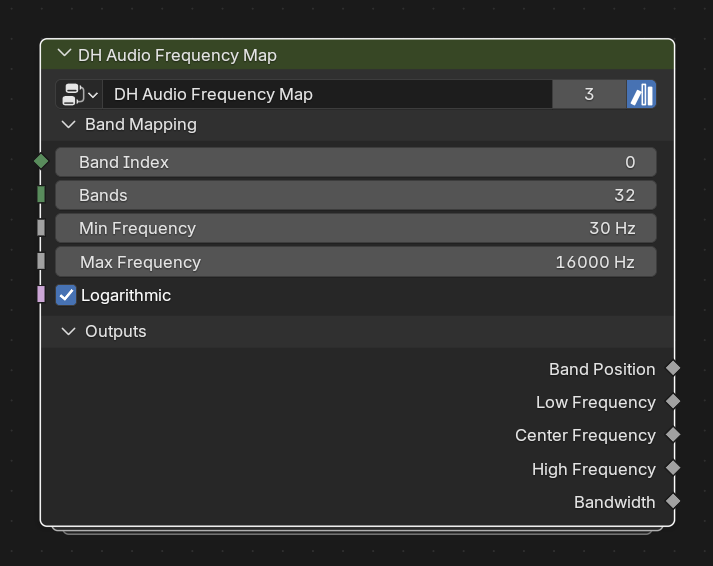

# DH Audio Frequency Map

**Category:** Utilities 
**Blender domain:** GeometryNodeTree 
**Default node width:** 300 px

Advanced utility: map a band index to linear or logarithmic frequency bounds.

## Agent notes

- Band Index is zero-based. Keep Min Frequency below Max Frequency and enable Logarithmic for perceptual spacing.
- Most users should let Analyzer handle this; use it directly only for a custom carrier or frequency-aware effect.

## Interface panels

- **Band Mapping**: open by default; Convert an indexed band into frequency bounds
- **Outputs**: open by default; Mapped band position and frequency metadata

## Inputs

| Panel | Socket | Type | Default | Description |
| --- | --- | --- | --- | --- |
| Band Mapping | **Band Index** | NodeSocketInt | 0 | Zero-based band index |
| Band Mapping | **Bands** | NodeSocketInt | 32 | Total number of bands |
| Band Mapping | **Min Frequency** | NodeSocketFloat | 30 | none |
| Band Mapping | **Max Frequency** | NodeSocketFloat | 1.6e+04 | none |
| Band Mapping | **Logarithmic** | NodeSocketBool | on | none |

## Outputs

| Panel | Socket | Type | Default | Description |
| --- | --- | --- | --- | --- |
| Outputs | **Band Position** | NodeSocketFloat | 0 | none |
| Outputs | **Low Frequency** | NodeSocketFloat | 0 | none |
| Outputs | **Center Frequency** | NodeSocketFloat | 0 | none |
| Outputs | **High Frequency** | NodeSocketFloat | 0 | none |
| Outputs | **Bandwidth** | NodeSocketFloat | 0 | none |

## Verification source

This page was generated from the public Blender interface exported by
tools/export_public_node_interfaces.py against a fresh toolkit build. Update
the screenshot and regenerate this page whenever the public interface changes.
