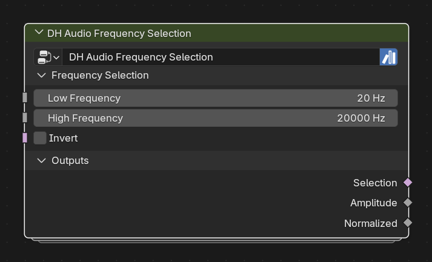

# DH Audio Frequency Selection

**Category:** Utilities 
**Blender domain:** GeometryNodeTree 
**Default node width:** 280 px

Select DH Audio spectrum elements by actual center-frequency range, with convenient amplitude and normalized pass-through fields.

## Agent notes

- Requires spectrum geometry with dh_audio_center_hz, normally from Analyzer or a compatible carrier.
- Use Selection on downstream Selection inputs to target a physical frequency range without relying on band count.

## Interface panels

- **Frequency Selection**: open by default; Select spectrum elements by stored center frequency
- **Outputs**: open by default

## Inputs

| Panel | Socket | Type | Default | Description |
| --- | --- | --- | --- | --- |
| Frequency Selection | **Low Frequency** | NodeSocketFloat | 20 | Inclusive lower bound |
| Frequency Selection | **High Frequency** | NodeSocketFloat | 2e+04 | Inclusive upper bound |
| Frequency Selection | **Invert** | NodeSocketBool | off | none |

## Outputs

| Panel | Socket | Type | Default | Description |
| --- | --- | --- | --- | --- |
| Outputs | **Selection** | NodeSocketBool | off | Boolean field based on dh_audio_center_hz |
| Outputs | **Amplitude** | NodeSocketFloat | 0 | Convenience pass-through of dh_audio_amp |
| Outputs | **Normalized** | NodeSocketFloat | 0 | Convenience pass-through of dh_audio_norm |

## Verification source

This page was generated from the public Blender interface exported by
tools/export_public_node_interfaces.py against a fresh toolkit build. Update
the screenshot and regenerate this page whenever the public interface changes.
