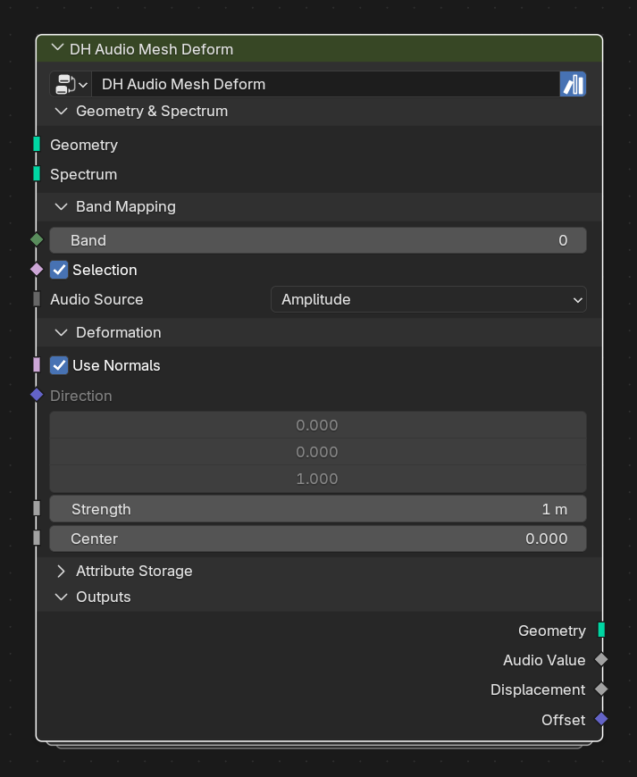

# DH Audio Mesh Deform

**Category:** Transport 
**Blender domain:** GeometryNodeTree 
**Default node width:** 340 px

Displace arbitrary mesh or curve points from a reusable mono/stereo spectrum, with per-point band mapping and material-ready attributes.

## Agent notes

- Band and Selection evaluate per point. Use Normals for surface-following displacement or Direction for an explicit vector.
- Enable storage only when downstream geometry or materials need standard attributes after deformation.

## Interface panels

- **Geometry & Spectrum**: open by default; Target geometry and reusable Analyzer-compatible carrier
- **Band Mapping**: open by default; Choose the sampled band and audio value per target point
- **Deformation**: open by default; Audio-driven point displacement controls
- **Attribute Storage**: collapsed by default; Optional material-ready standard attribute transport
- **Outputs**: open by default; Deformed geometry and the fields used to produce it

## Inputs

| Panel | Socket | Type | Default | Description |
| --- | --- | --- | --- | --- |
| Geometry & Spectrum | **Geometry** | NodeSocketGeometry | none | Mesh or curve control points to displace |
| Geometry & Spectrum | **Spectrum** | NodeSocketGeometry | none | Reusable carrier from Analyzer, Stereo Analyzer, or Spectrum Bars |
| Band Mapping | **Band** | NodeSocketInt | 0 | Zero-based band field evaluated on target points |
| Band Mapping | **Selection** | NodeSocketBool | on | Points to displace and receive stored audio attributes |
| Band Mapping | **Audio Source** | NodeSocketMenu | Amplitude | Amplitude/Normalized/Raw from mono carriers or paired Left/Right values from Stereo Analyzer carriers |
| Deformation | **Use Normals** | NodeSocketBool | on | Displace along the evaluated surface normal instead of Direction |
| Deformation | **Direction** | NodeSocketVector | (0, 0, 1) | Per-point displacement direction when Use Normals is disabled |
| Deformation | **Strength** | NodeSocketFloat | 1 | Distance multiplier applied after subtracting Center |
| Deformation | **Center** | NodeSocketFloat | 0 | Audio value treated as zero displacement |
| Attribute Storage | **Store on Points** | NodeSocketBool | on | Store standard attributes on deformed mesh/curve points |
| Attribute Storage | **Store on Instances** | NodeSocketBool | off | Also store standard attributes on any untouched instance components |

## Outputs

| Panel | Socket | Type | Default | Description |
| --- | --- | --- | --- | --- |
| Outputs | **Geometry** | NodeSocketGeometry | none | Audio-displaced geometry carrying enabled standard attributes |
| Outputs | **Audio Value** | NodeSocketFloat | 0 | Selected audio source before centering and strength |
| Outputs | **Displacement** | NodeSocketFloat | 0 | Signed displacement distance after Center and Strength |
| Outputs | **Offset** | NodeSocketVector | (0, 0, 0) | Final per-point offset vector |

## Verification source

This page was generated from the public Blender interface exported by
tools/export_public_node_interfaces.py against a fresh toolkit build. Update
the screenshot and regenerate this page whenever the public interface changes.
