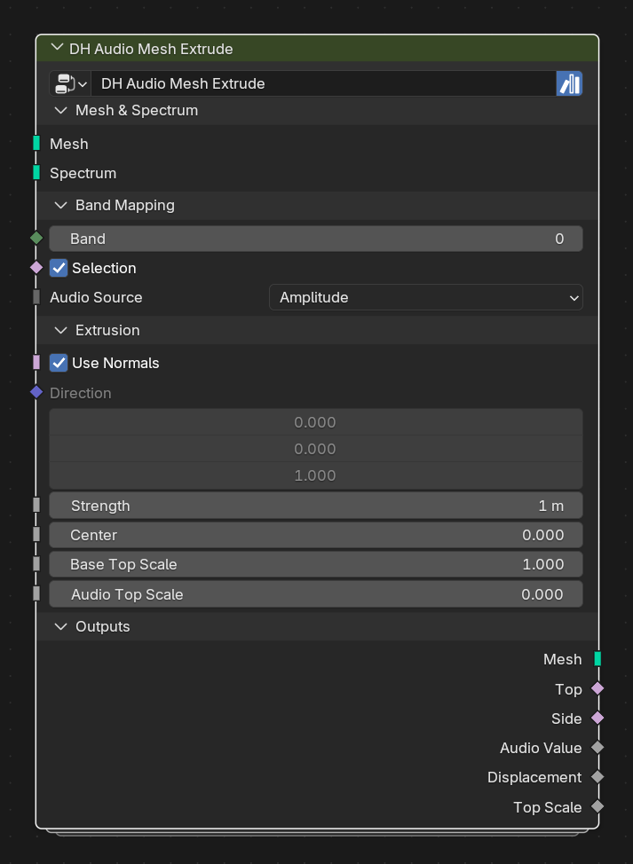

# DH Audio Mesh Extrude

**Category:** Transport 
**Blender domain:** GeometryNodeTree 
**Default node width:** 350 px

Extrude mesh faces from a reusable mono/stereo spectrum with per-face band mapping, top scaling, and standard face-domain material attributes.

## Agent notes

- Band and Selection evaluate per face. Normal mode treats faces independently; Direction mode moves the connected selected region.
- Use Top and Side outputs to assign materials or process the extrusion result selectively.

## Interface panels

- **Mesh & Spectrum**: open by default; Target mesh and reusable Analyzer-compatible carrier
- **Band Mapping**: open by default; Choose the sampled band and audio value per face
- **Extrusion**: open by default; Face offset, normal/direction, and top scaling
- **Outputs**: open by default; Extruded mesh, selections, and diagnostic fields

## Inputs

| Panel | Socket | Type | Default | Description |
| --- | --- | --- | --- | --- |
| Mesh & Spectrum | **Mesh** | NodeSocketGeometry | none | Mesh faces to extrude |
| Mesh & Spectrum | **Spectrum** | NodeSocketGeometry | none | Reusable carrier from Analyzer, Stereo Analyzer, or Spectrum Bars |
| Band Mapping | **Band** | NodeSocketInt | 0 | Zero-based band field evaluated on target faces |
| Band Mapping | **Selection** | NodeSocketBool | on | Faces to extrude and receive standard audio attributes |
| Band Mapping | **Audio Source** | NodeSocketMenu | Amplitude | Amplitude/Normalized/Raw from mono carriers or paired Left/Right values from Stereo Analyzer carriers |
| Extrusion | **Use Normals** | NodeSocketBool | on | Extrude along face normals instead of Direction |
| Extrusion | **Direction** | NodeSocketVector | (0, 0, 1) | Per-face offset direction when Use Normals is disabled |
| Extrusion | **Strength** | NodeSocketFloat | 1 | Extrusion distance multiplier applied after Center |
| Extrusion | **Center** | NodeSocketFloat | 0 | Audio value treated as zero extrusion |
| Extrusion | **Base Top Scale** | NodeSocketFloat | 1 | Constant scale applied to extruded top faces |
| Extrusion | **Audio Top Scale** | NodeSocketFloat | 0 | Additional top-face scale multiplied by Audio Value |

## Outputs

| Panel | Socket | Type | Default | Description |
| --- | --- | --- | --- | --- |
| Outputs | **Mesh** | NodeSocketGeometry | none | Extruded mesh with standard spectrum/stereo face attributes |
| Outputs | **Top** | NodeSocketBool | off | Anonymous selection of extruded top faces |
| Outputs | **Side** | NodeSocketBool | off | Anonymous selection of generated side faces |
| Outputs | **Audio Value** | NodeSocketFloat | 0 | Selected audio source before centering and strength |
| Outputs | **Displacement** | NodeSocketFloat | 0 | Signed extrusion distance after Center and Strength |
| Outputs | **Top Scale** | NodeSocketFloat | 0 | Final top-face scale |

## Verification source

This page was generated from the public Blender interface exported by
tools/export_public_node_interfaces.py against a fresh toolkit build. Update
the screenshot and regenerate this page whenever the public interface changes.
