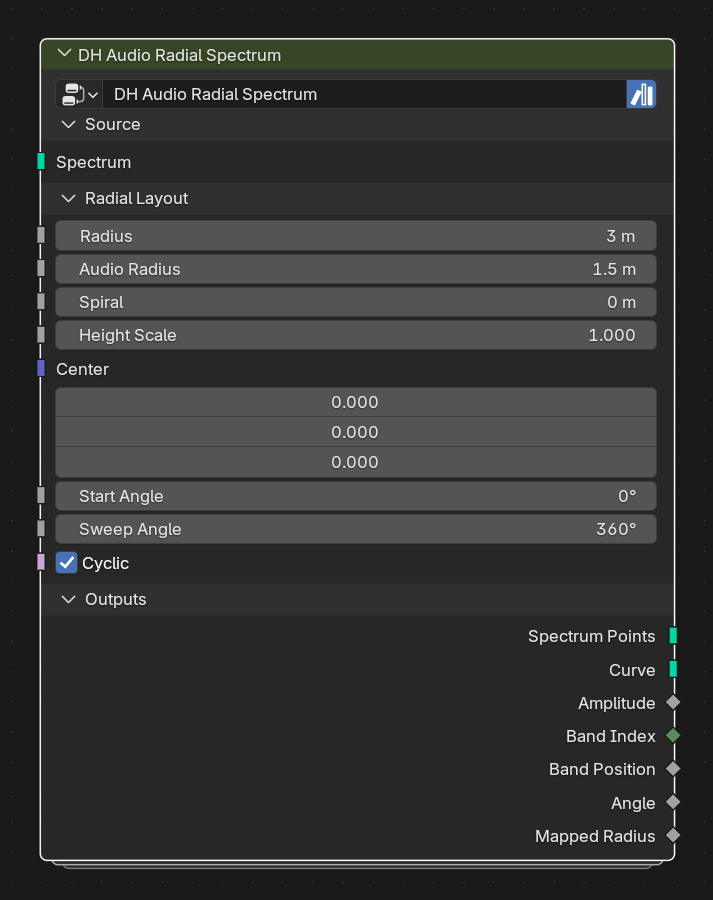

# DH Audio Radial Spectrum

**Category:** Mapping 
**Blender domain:** GeometryNodeTree 
**Default node width:** 315 px

Map DH Audio spectrum carrier geometry into circular, open-arc, or spiral layouts. Preserves spectrum attributes, supports radial audio displacement and source height, and outputs a correctly closed cyclic curve.

## Agent notes

- Use positioned Spectrum Points when source height should be retained; use a raw carrier for a clean radial layout.
- Cyclic closes the optional curve. Open arcs respect Start Angle and Sweep Angle endpoints.

## Interface panels

- **Source**: open by default; Spectrum carrier or positioned spectrum points
- **Radial Layout**: open by default; Circle, arc, spiral, height, and center controls
- **Outputs**: open by default; Mapped points, ready-to-use curve, and layout fields

## Inputs

| Panel | Socket | Type | Default | Description |
| --- | --- | --- | --- | --- |
| Source | **Spectrum** | NodeSocketGeometry | none | Spectrum carrier from DH Audio Analyzer, DH Audio Spectrum Points, or DH Audio Spectrum Bars Spectrum Points |
| Radial Layout | **Radius** | NodeSocketFloat | 3 | Base radius before audio and spiral displacement |
| Radial Layout | **Audio Radius** | NodeSocketFloat | 1.5 | Radial displacement added at dh_audio_amp = 1 |
| Radial Layout | **Spiral** | NodeSocketFloat | 0 | Radius added from the first to final dh_audio_band_pos |
| Radial Layout | **Height Scale** | NodeSocketFloat | 1 | Scale the source Z position before adding Center |
| Radial Layout | **Center** | NodeSocketVector | (0, 0, 0) | Center of the radial layout |
| Radial Layout | **Start Angle** | NodeSocketFloat | 0 | Angle of the first spectrum point |
| Radial Layout | **Sweep Angle** | NodeSocketFloat | 6.283 | Total angular span. Use a negative angle for clockwise order |
| Radial Layout | **Cyclic** | NodeSocketBool | on | Use unique cyclic spacing and close the Curve output. Disable for an open arc that includes both angular endpoints |

## Outputs

| Panel | Socket | Type | Default | Description |
| --- | --- | --- | --- | --- |
| Outputs | **Spectrum Points** | NodeSocketGeometry | none | Mapped mesh points preserving source topology and attributes |
| Outputs | **Curve** | NodeSocketGeometry | none | Mesh edges converted to a curve and closed when Cyclic is enabled |
| Outputs | **Amplitude** | NodeSocketFloat | 0 | Preserved dh_audio_amp field |
| Outputs | **Band Index** | NodeSocketInt | 0 | Preserved dh_audio_band_index field |
| Outputs | **Band Position** | NodeSocketFloat | 0 | Preserved dh_audio_band_pos field |
| Outputs | **Angle** | NodeSocketFloat | 0 | Calculated angular position field |
| Outputs | **Mapped Radius** | NodeSocketFloat | 0 | Calculated base + audio + spiral radius field |

## Verification source

This page was generated from the public Blender interface exported by
tools/export_public_node_interfaces.py against a fresh toolkit build. Update
the screenshot and regenerate this page whenever the public interface changes.
