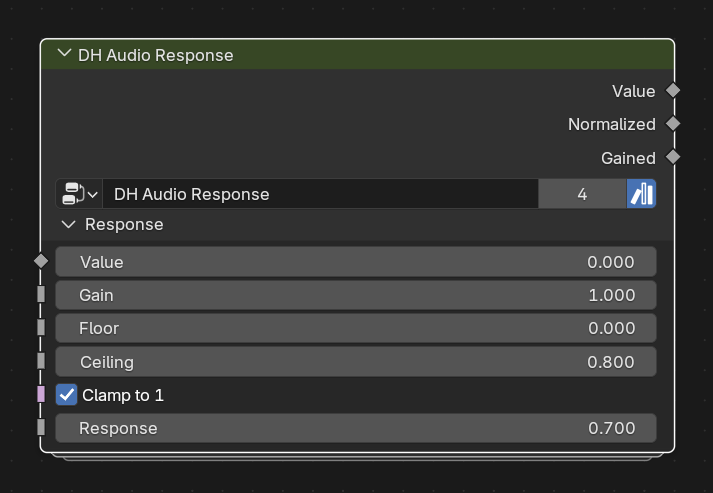

# DH Audio Response

**Category:** Utilities 
**Blender domain:** GeometryNodeTree 
**Default node width:** 285 px

Reusable Geometry Nodes response shaper for audio amplitude or any scalar field.

## Agent notes

- This is stateless scalar shaping. Use it wherever a positive value needs gain, normalization, clamp, and a power response.
- Use Temporal Response instead when frame-to-frame smoothing or peak state is required.

## Interface panels

- **Response**: open by default; Reusable amplitude normalization and response shaping

## Inputs

| Panel | Socket | Type | Default | Description |
| --- | --- | --- | --- | --- |
| Response | **Value** | NodeSocketFloat | 0 | Raw amplitude or any positive value to shape |
| Response | **Gain** | NodeSocketFloat | 1 | Multiplier applied before normalization |
| Response | **Floor** | NodeSocketFloat | 0 | Post-gain amplitude mapped to zero |
| Response | **Ceiling** | NodeSocketFloat | 0.8 | Post-gain amplitude mapped to one |
| Response | **Clamp to 1** | NodeSocketBool | on | Clamp normalized amplitude to a maximum of one |
| Response | **Response** | NodeSocketFloat | 0.7 | Power curve. Below 1 emphasizes quieter values; above 1 emphasizes peaks |

## Outputs

| Panel | Socket | Type | Default | Description |
| --- | --- | --- | --- | --- |
| none | **Value** | NodeSocketFloat | 0 | Processed response after power curve |
| none | **Normalized** | NodeSocketFloat | 0 | Normalized value before the Response power curve |
| none | **Gained** | NodeSocketFloat | 0 | Input multiplied by Gain |

## Verification source

This page was generated from the public Blender interface exported by
tools/export_public_node_interfaces.py against a fresh toolkit build. Update
the screenshot and regenerate this page whenever the public interface changes.
