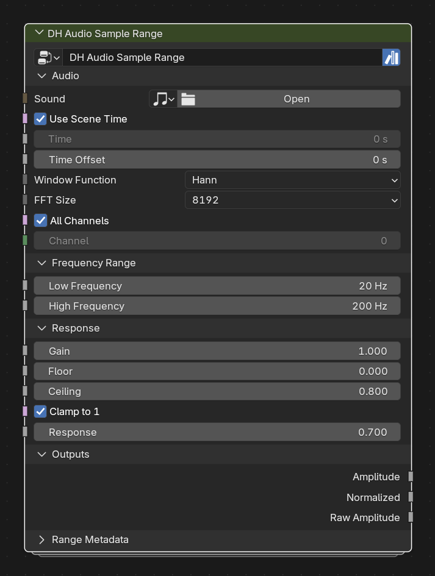

# DH Audio Sample Range

**Category:** Analysis 
**Blender domain:** GeometryNodeTree 
**Default node width:** 315 px

Sample any custom frequency range directly, independent of spectrum band indexing.

## Agent notes

- Choose this for one custom frequency range rather than a full carrier. It is deliberately scalar-first.
- For many independently sampled bands, prefer Spectrum Sample over duplicating this node.

## Key choices

- **Window Function** and **FFT Size** use Blender 5.2's native Sample Sound Frequencies menus; their defaults are Hann and 8192.

## Interface panels

- **Audio**: open by default; Sound, time, channel and FFT controls
- **Frequency Range**: open by default; Arbitrary custom frequency range
- **Response**: open by default; Normalize and shape the sampled amplitude
- **Outputs**: open by default; Sampled and processed scalar values
- **Range Metadata**: collapsed by default; Frequency bounds and bandwidth

## Inputs

| Panel | Socket | Type | Default | Description |
| --- | --- | --- | --- | --- |
| Audio | **Sound** | NodeSocketSound | none | Required: Sound data-block to analyze. An unassigned Sound produces zero amplitude, which is indistinguishable from silent audio inside Geometry Nodes |
| Audio | **Use Scene Time** | NodeSocketBool | on | Use Scene Time. Disable to use the custom Time input |
| Audio | **Time** | NodeSocketFloat | 0 | Custom time in seconds when Use Scene Time is disabled |
| Audio | **Time Offset** | NodeSocketFloat | 0 | Seconds added to the selected time source |
| Audio | **Window Function** | NodeSocketMenu | Hann | FFT window function |
| Audio | **FFT Size** | NodeSocketMenu | 8192 | FFT analysis size. Higher values improve frequency resolution but reduce time resolution |
| Audio | **All Channels** | NodeSocketBool | on | Mix all channels before sampling |
| Audio | **Channel** | NodeSocketInt | 0 | Channel used when All Channels is disabled |
| Frequency Range | **Low Frequency** | NodeSocketFloat | 20 | Lower bound of the sampled frequency range |
| Frequency Range | **High Frequency** | NodeSocketFloat | 200 | Upper bound. Internally clamped to be at least Low Frequency |
| Response | **Gain** | NodeSocketFloat | 1 | Multiplier applied before normalization |
| Response | **Floor** | NodeSocketFloat | 0 | Post-gain amplitude mapped to zero |
| Response | **Ceiling** | NodeSocketFloat | 0.8 | Post-gain amplitude mapped to one |
| Response | **Clamp to 1** | NodeSocketBool | on | Clamp normalized amplitude to a maximum of one |
| Response | **Response** | NodeSocketFloat | 0.7 | Power curve. Below 1 emphasizes quieter values; above 1 emphasizes peaks |

## Outputs

| Panel | Socket | Type | Default | Description |
| --- | --- | --- | --- | --- |
| Outputs | **Amplitude** | NodeSocketFloat | 0 | none |
| Outputs | **Normalized** | NodeSocketFloat | 0 | none |
| Outputs | **Raw Amplitude** | NodeSocketFloat | 0 | none |
| Range Metadata | **Low Frequency** | NodeSocketFloat | 0 | none |
| Range Metadata | **Center Frequency** | NodeSocketFloat | 0 | none |
| Range Metadata | **High Frequency** | NodeSocketFloat | 0 | none |
| Range Metadata | **Bandwidth** | NodeSocketFloat | 0 | none |

## Verification source

This page was generated from the public Blender interface exported by
tools/export_public_node_interfaces.py against a fresh toolkit build. Update
the screenshot and regenerate this page whenever the public interface changes.
