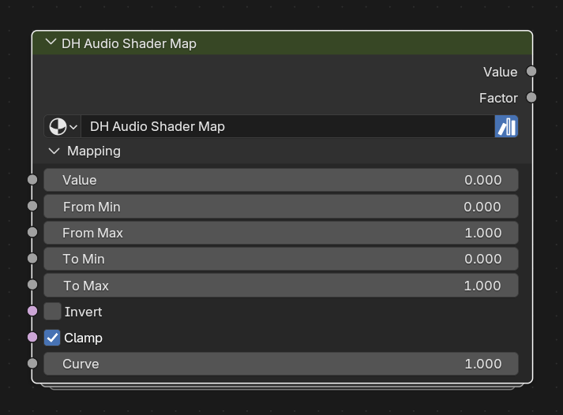

# DH Audio Shader Map

**Category:** Shaders 
**Blender domain:** ShaderNodeTree 
**Default node width:** 300 px

Remap, invert, clamp, and shape any DH Audio material value. Useful for amplitude thresholds, named-band controls, and Spectrum History fades.

## Agent notes

- Set From Min and From Max to the meaningful source range before shaping. Clamp and Invert act on the normalized factor.
- Use this before Shader UV Transform when a raw audio value needs a controlled mapping range.

## Interface panels

- **Mapping**: open by default; Remap audio, history, or named-band values into a shader-ready range

## Inputs

| Panel | Socket | Type | Default | Description |
| --- | --- | --- | --- | --- |
| Mapping | **Value** | NodeSocketFloat | 0 | Value to remap, such as Amplitude or History Position |
| Mapping | **From Min** | NodeSocketFloat | 0 | Input value that becomes factor 0 |
| Mapping | **From Max** | NodeSocketFloat | 1 | Input value that becomes factor 1; keep greater than From Min |
| Mapping | **To Min** | NodeSocketFloat | 0 | Output value at factor 0 |
| Mapping | **To Max** | NodeSocketFloat | 1 | Output value at factor 1 |
| Mapping | **Invert** | NodeSocketBool | off | Reverse the normalized factor before shaping |
| Mapping | **Clamp** | NodeSocketBool | on | Clamp the normalized factor to 0..1 before inversion and shaping |
| Mapping | **Curve** | NodeSocketFloat | 1 | Power response: 1 is linear, below 1 rises sooner, above 1 rises later |

## Outputs

| Panel | Socket | Type | Default | Description |
| --- | --- | --- | --- | --- |
| none | **Value** | NodeSocketFloat | 0 | Final shaped value remapped between To Min and To Max |
| none | **Factor** | NodeSocketFloat | 0 | Normalized factor after optional clamp, inversion, and curve shaping |

## Verification source

This page was generated from the public Blender interface exported by
tools/export_public_node_interfaces.py against a fresh toolkit build. Update
the screenshot and regenerate this page whenever the public interface changes.
