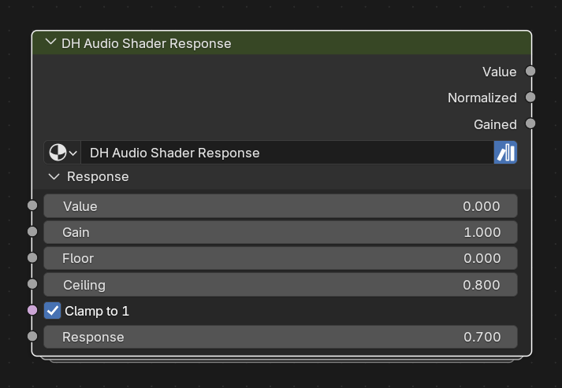

# DH Audio Shader Response

**Category:** Shaders 
**Blender domain:** ShaderNodeTree 
**Default node width:** 285 px

Shader-side audio response shaper matching DH Audio Response.

## Agent notes

- This is the material-side, stateless counterpart to DH Audio Response.
- Feed a scalar such as Material Reader Amplitude, Peak, History Position, or a named band.

## Interface panels

- **Response**: open by default; Shader-side equivalent of DH Audio Response

## Inputs

| Panel | Socket | Type | Default | Description |
| --- | --- | --- | --- | --- |
| Response | **Value** | NodeSocketFloat | 0 | none |
| Response | **Gain** | NodeSocketFloat | 1 | none |
| Response | **Floor** | NodeSocketFloat | 0 | none |
| Response | **Ceiling** | NodeSocketFloat | 0.8 | none |
| Response | **Clamp to 1** | NodeSocketBool | on | Clamp normalized response to a maximum of 1 |
| Response | **Response** | NodeSocketFloat | 0.7 | none |

## Outputs

| Panel | Socket | Type | Default | Description |
| --- | --- | --- | --- | --- |
| none | **Value** | NodeSocketFloat | 0 | none |
| none | **Normalized** | NodeSocketFloat | 0 | none |
| none | **Gained** | NodeSocketFloat | 0 | none |

## Verification source

This page was generated from the public Blender interface exported by
tools/export_public_node_interfaces.py against a fresh toolkit build. Update
the screenshot and regenerate this page whenever the public interface changes.
