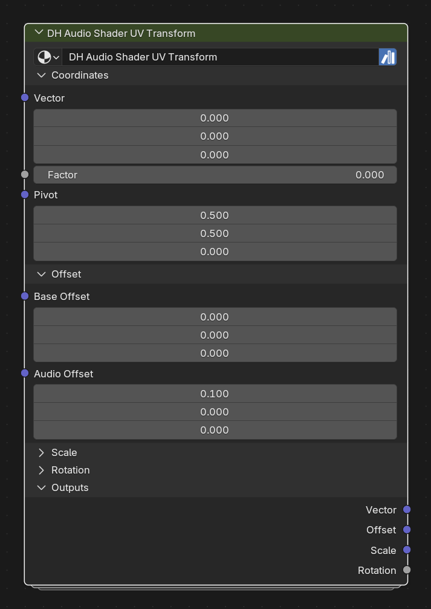

# DH Audio Shader UV Transform

**Category:** Shaders 
**Blender domain:** ShaderNodeTree 
**Default node width:** 320 px

Transform shader UV or texture coordinates with an audio/history factor: pivot-centered scale and rotation plus animated offset.

## Agent notes

- Feed coordinates plus a scalar Factor. Base controls are always applied; Audio controls are multiplied by Factor.
- Use Effective outputs for debugging or for sharing the exact transformed values with other shader logic.

## Interface panels

- **Coordinates**: open by default; Input coordinates and the audio/history/named-band factor
- **Offset**: open by default; Constant and factor-driven coordinate translation
- **Scale**: collapsed by default; Pivot-centered constant and factor-driven scale
- **Rotation**: collapsed by default; Pivot-centered Z rotation in radians/degrees UI units
- **Outputs**: open by default; Transformed coordinates and effective controls

## Inputs

| Panel | Socket | Type | Default | Description |
| --- | --- | --- | --- | --- |
| Coordinates | **Vector** | NodeSocketVector | (0, 0, 0) | Texture Coordinate, UV, Generated, Object, or another shader vector |
| Coordinates | **Factor** | NodeSocketFloat | 0 | Audio, named-band, or history value; shape it with DH Audio Shader Map |
| Coordinates | **Pivot** | NodeSocketVector | (0.5, 0.5, 0) | Center used by Scale and Rotation |
| Offset | **Base Offset** | NodeSocketVector | (0, 0, 0) | Constant coordinate offset |
| Offset | **Audio Offset** | NodeSocketVector | (0.1, 0, 0) | Offset multiplied by Factor |
| Scale | **Base Scale** | NodeSocketVector | (1, 1, 1) | Constant pivot-centered scale |
| Scale | **Audio Scale** | NodeSocketVector | (0, 0, 0) | Additional scale multiplied by Factor |
| Rotation | **Base Rotation** | NodeSocketFloat | 0 | Constant Z rotation around Pivot |
| Rotation | **Audio Rotation** | NodeSocketFloat | 0 | Additional Z rotation multiplied by Factor |

## Outputs

| Panel | Socket | Type | Default | Description |
| --- | --- | --- | --- | --- |
| Outputs | **Vector** | NodeSocketVector | (0, 0, 0) | Final transformed coordinates |
| Outputs | **Offset** | NodeSocketVector | (0, 0, 0) | Base Offset + Audio Offset × Factor |
| Outputs | **Scale** | NodeSocketVector | (0, 0, 0) | Base Scale + Audio Scale × Factor |
| Outputs | **Rotation** | NodeSocketFloat | 0 | Base Rotation + Audio Rotation × Factor |

## Verification source

This page was generated from the public Blender interface exported by
tools/export_public_node_interfaces.py against a fresh toolkit build. Update
the screenshot and regenerate this page whenever the public interface changes.
