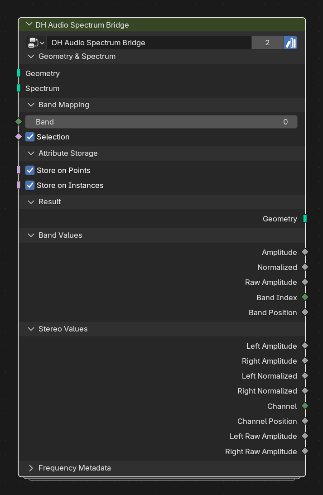

# DH Audio Spectrum Bridge

**Category:** Transport 
**Blender domain:** GeometryNodeTree 
**Default node width:** 340 px

Map reusable spectrum bands across arbitrary geometry or instances, store the standard material attributes, and expose the sampled fields directly.

## Agent notes

- Use this to stamp standard mono and stereo attributes onto arbitrary geometry or instances.
- Choose storage domains deliberately. Material Reader needs attributes on the geometry or instancer path it reads.

## Interface panels

- **Geometry & Spectrum**: open by default; Target geometry and reusable Analyzer-compatible carrier
- **Band Mapping**: open by default; Choose a spectrum band independently for each target element
- **Attribute Storage**: open by default; Store sampled values for geometry materials, instancer materials, or both
- **Result**: open by default; Target geometry carrying the selected audio attributes
- **Band Values**: open by default; Common sampled values for direct geometry operations
- **Stereo Values**: open by default; Paired values from DH Audio Stereo Analyzer; zero when the source does not carry stereo attributes
- **Frequency Metadata**: collapsed by default; Detailed sampled frequency bounds

## Inputs

| Panel | Socket | Type | Default | Description |
| --- | --- | --- | --- | --- |
| Geometry & Spectrum | **Geometry** | NodeSocketGeometry | none | Arbitrary target geometry or instances that should receive audio attributes |
| Geometry & Spectrum | **Spectrum** | NodeSocketGeometry | none | Reusable carrier from DH Audio Analyzer, Stereo Analyzer, Spectrum Bars, or another compatible source |
| Band Mapping | **Band** | NodeSocketInt | 0 | Zero-based band field evaluated on each enabled storage domain. Connect Index, ID, a face group, or another integer field |
| Band Mapping | **Selection** | NodeSocketBool | on | Elements on the enabled domains that receive sampled attributes |
| Attribute Storage | **Store on Points** | NodeSocketBool | on | Write standard attributes on mesh vertices or curve control points. Recommended for realized geometry and normal material lookup |
| Attribute Storage | **Store on Instances** | NodeSocketBool | on | Write standard attributes on the instance domain for Material Reader with Use Instancer enabled |

## Outputs

| Panel | Socket | Type | Default | Description |
| --- | --- | --- | --- | --- |
| Result | **Geometry** | NodeSocketGeometry | none | Target geometry with sampled spectrum attributes stored on enabled domains |
| Band Values | **Amplitude** | NodeSocketFloat | 0 | Sampled 'dh_audio_amp' field for direct downstream use |
| Band Values | **Normalized** | NodeSocketFloat | 0 | Sampled 'dh_audio_norm' field for direct downstream use |
| Band Values | **Raw Amplitude** | NodeSocketFloat | 0 | Sampled 'dh_audio_raw' field for direct downstream use |
| Band Values | **Band Index** | NodeSocketInt | 0 | Sampled 'dh_audio_band_index' field for direct downstream use |
| Band Values | **Band Position** | NodeSocketFloat | 0 | Sampled 'dh_audio_band_pos' field for direct downstream use |
| Stereo Values | **Left Amplitude** | NodeSocketFloat | 0 | Sampled paired stereo field 'dh_audio_left_amp' |
| Stereo Values | **Right Amplitude** | NodeSocketFloat | 0 | Sampled paired stereo field 'dh_audio_right_amp' |
| Stereo Values | **Left Normalized** | NodeSocketFloat | 0 | Sampled paired stereo field 'dh_audio_left_norm' |
| Stereo Values | **Right Normalized** | NodeSocketFloat | 0 | Sampled paired stereo field 'dh_audio_right_norm' |
| Stereo Values | **Channel** | NodeSocketInt | 0 | Sampled paired stereo field 'dh_audio_channel' |
| Stereo Values | **Channel Position** | NodeSocketFloat | 0 | Sampled paired stereo field 'dh_audio_channel_pos' |
| Stereo Values | **Left Raw Amplitude** | NodeSocketFloat | 0 | Sampled paired stereo field 'dh_audio_left_raw' |
| Stereo Values | **Right Raw Amplitude** | NodeSocketFloat | 0 | Sampled paired stereo field 'dh_audio_right_raw' |
| Frequency Metadata | **Low Frequency** | NodeSocketFloat | 0 | Sampled 'dh_audio_low_hz' field for direct downstream use |
| Frequency Metadata | **Center Frequency** | NodeSocketFloat | 0 | Sampled 'dh_audio_center_hz' field for direct downstream use |
| Frequency Metadata | **High Frequency** | NodeSocketFloat | 0 | Sampled 'dh_audio_high_hz' field for direct downstream use |
| Frequency Metadata | **Bandwidth** | NodeSocketFloat | 0 | Sampled 'dh_audio_bandwidth_hz' field for direct downstream use |

## Verification source

This page was generated from the public Blender interface exported by
tools/export_public_node_interfaces.py against a fresh toolkit build. Update
the screenshot and regenerate this page whenever the public interface changes.
