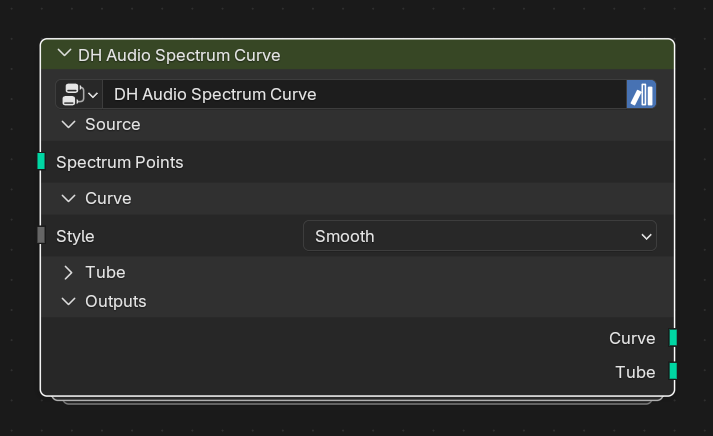

# DH Audio Spectrum Curve

**Category:** Visualizers 
**Blender domain:** GeometryNodeTree 
**Default node width:** 310 px

Convert positioned spectrum points into a raw, Catmull-Rom smooth, or resampled curve, with optional audio-reactive tube radius.

## Agent notes

- Feed ordered positioned points from Spectrum Points or Spectrum Bars.
- Smooth plus Resample changes point count; use it when even topology is more important than original per-band points.

## Key choices

- **Curve Style:** Raw, Smooth, or Smooth + Resample.
- **Tube:** off produces a curve; on turns the selected curve style into an audio-reactive tube.

## Interface panels

- **Source**: open by default; Already-positioned spectrum points
- **Curve**: open by default; Smoothing and resampling
- **Tube**: collapsed by default; Optional mesh generated around the curve
- **Outputs**: open by default

## Inputs

| Panel | Socket | Type | Default | Description |
| --- | --- | --- | --- | --- |
| Source | **Spectrum Points** | NodeSocketGeometry | none | Use DH Audio Spectrum Points -> Spectrum Points or DH Audio Spectrum Bars -> Spectrum Points |
| Curve | **Curve Style** | NodeSocketMenu | Smooth | Raw polyline, Catmull-Rom smoothing, or smooth resampled output |
| Curve | **Resample Count** | NodeSocketInt | 128 | Point count used by Smooth + Resample |
| Tube | **Tube Radius** | NodeSocketFloat | 0.02 | Base tube profile radius |
| Tube | **Audio Radius** | NodeSocketFloat | 0 | Audio-reactive multiplier for the Tube output only. 0 = constant thickness; 1 = up to 2x thickness at amplitude 1. |
| Tube | **Tube Resolution** | NodeSocketInt | 8 | Vertices around the tube profile |
| Tube | **Material** | NodeSocketMaterial | none | none |

## Outputs

| Panel | Socket | Type | Default | Description |
| --- | --- | --- | --- | --- |
| Outputs | **Curve** | NodeSocketGeometry | none | none |
| Outputs | **Tube** | NodeSocketGeometry | none | none |

## Verification source

This page was generated from the public Blender interface exported by
tools/export_public_node_interfaces.py against a fresh toolkit build. Update
the screenshot and regenerate this page whenever the public interface changes.
