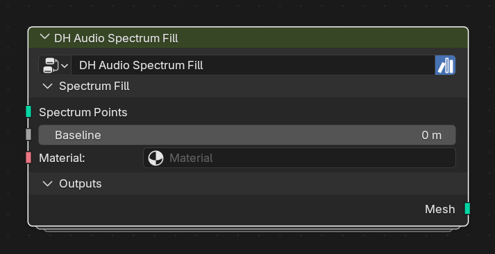

# DH Audio Spectrum Fill

**Category:** Visualizers 
**Blender domain:** GeometryNodeTree 
**Default node width:** 290 px

Build a filled quad strip below positioned spectrum points. Accepts DH Audio Spectrum Points, Stereo Points channel outputs, or Spectrum Bars' Spectrum Points while preserving stereo attributes.

## Agent notes

- Feed positioned, ordered Spectrum Points. It creates a quad strip down to Baseline.
- Use the output for a silhouette; use Curve when only a line or tube is needed.

## Interface panels

- **Spectrum Fill**: open by default; Fill below already-positioned spectrum points
- **Outputs**: open by default

## Inputs

| Panel | Socket | Type | Default | Description |
| --- | --- | --- | --- | --- |
| Spectrum Fill | **Spectrum Points** | NodeSocketGeometry | none | Use DH Audio Spectrum Points -> Spectrum Points or DH Audio Spectrum Bars -> Spectrum Points |
| Spectrum Fill | **Baseline** | NodeSocketFloat | 0 | Flat Z value used for the bottom edge |
| Spectrum Fill | **Material** | NodeSocketMaterial | none | none |

## Outputs

| Panel | Socket | Type | Default | Description |
| --- | --- | --- | --- | --- |
| Outputs | **Mesh** | NodeSocketGeometry | none | Filled quad strip carrying common spectrum attributes |

## Verification source

This page was generated from the public Blender interface exported by
tools/export_public_node_interfaces.py against a fresh toolkit build. Update
the screenshot and regenerate this page whenever the public interface changes.
