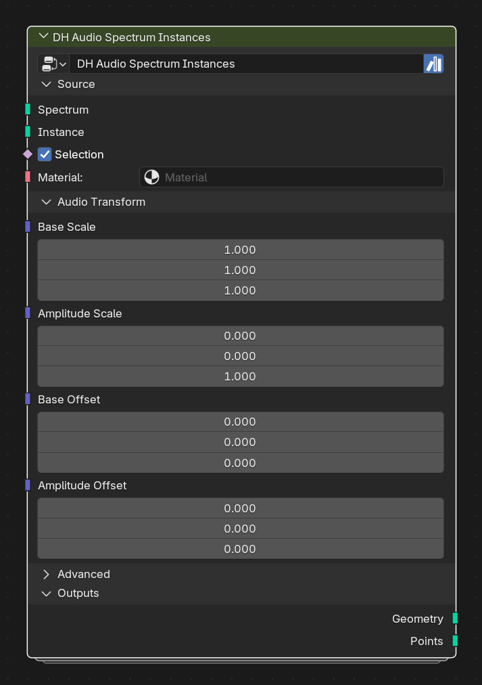

# DH Audio Spectrum Instances

**Category:** Visualizers 
**Blender domain:** GeometryNodeTree 
**Default node width:** 315 px

Generic spectrum consumer: instance any geometry on analyzer bands and drive scale/position with amplitude.

## Agent notes

- Use this when every band should instance your own geometry. The input instance is reused, not automatically realized.
- Keep attributes on the instance domain when Material Reader must access them with Use Instancer enabled.

## Interface panels

- **Source**: open by default; Spectrum carrier and geometry to instance
- **Audio Transform**: open by default; Use amplitude to add scale and position changes
- **Advanced**: collapsed by default; Layout and realization controls
- **Outputs**: open by default

## Inputs

| Panel | Socket | Type | Default | Description |
| --- | --- | --- | --- | --- |
| Source | **Spectrum** | NodeSocketGeometry | none | Use the Spectrum output from DH Audio Analyzer |
| Source | **Instance** | NodeSocketGeometry | none | Any mesh, curve, or other geometry to instance once per spectrum band |
| Source | **Selection** | NodeSocketBool | on | Field selecting which spectrum points receive instances |
| Source | **Material** | NodeSocketMaterial | none | Optional material applied to the instance geometry |
| Audio Transform | **Base Scale** | NodeSocketVector | (1, 1, 1) | Scale before audio is added |
| Audio Transform | **Amplitude Scale** | NodeSocketVector | (0, 0, 1) | Additional scale at amplitude 1.0 |
| Audio Transform | **Base Offset** | NodeSocketVector | (0, 0, 0) | Constant point offset |
| Audio Transform | **Amplitude Offset** | NodeSocketVector | (0, 0, 0) | Additional point offset at amplitude 1.0 |
| Advanced | **Center Spectrum** | NodeSocketBool | on | Center the spectrum horizontally around X=0 |
| Advanced | **Realize Instances** | NodeSocketBool | off | Realize the output when downstream mesh operations require it |

## Outputs

| Panel | Socket | Type | Default | Description |
| --- | --- | --- | --- | --- |
| Outputs | **Geometry** | NodeSocketGeometry | none | none |
| Outputs | **Points** | NodeSocketGeometry | none | none |

## Verification source

This page was generated from the public Blender interface exported by
tools/export_public_node_interfaces.py against a fresh toolkit build. Update
the screenshot and regenerate this page whenever the public interface changes.
