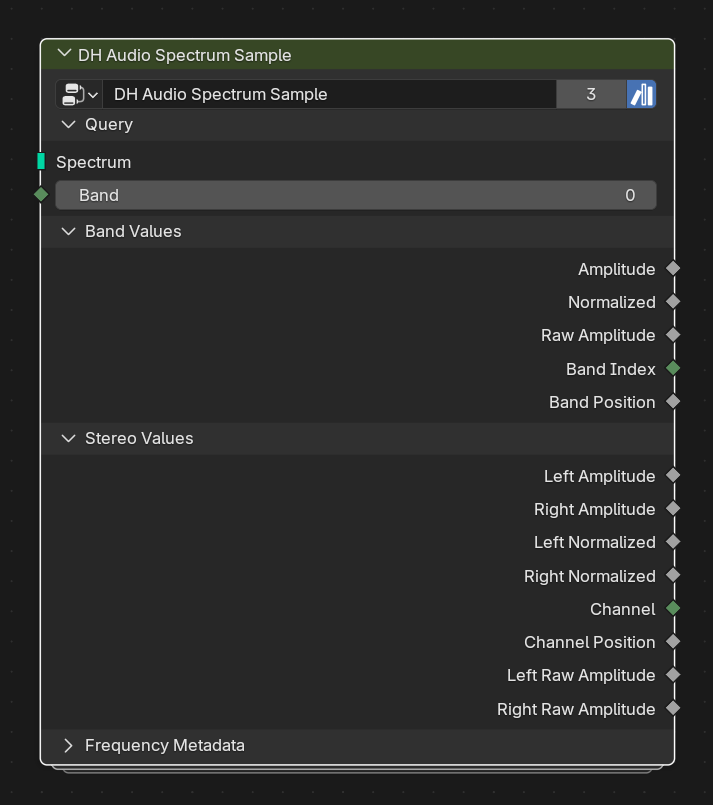

# DH Audio Spectrum Sample

**Category:** Query 
**Blender domain:** GeometryNodeTree 
**Default node width:** 310 px

Sample reusable spectrum and paired stereo attributes with a per-element band field for arbitrary deformation, array, instance, and attribute workflows.

## Agent notes

- Band is a field, so it can vary on the downstream evaluation domain.
- It reads fields but does not write attributes. Pair it with Spectrum Bridge when a material needs sampled values later.

## Interface panels

- **Query**: open by default; Sample Analyzer-compatible carrier geometry with a per-element zero-based band field
- **Band Values**: open by default; Common sampled spectrum values
- **Stereo Values**: open by default; Paired left/right values written by DH Audio Stereo Analyzer. These evaluate as zero when the source does not carry stereo attributes
- **Frequency Metadata**: collapsed by default; Detailed sampled frequency bounds

## Inputs

| Panel | Socket | Type | Default | Description |
| --- | --- | --- | --- | --- |
| Query | **Spectrum** | NodeSocketGeometry | none | Reusable carrier from DH Audio Analyzer, Stereo Analyzer, Spectrum Bars, or another compatible source |
| Query | **Band** | NodeSocketInt | 0 | Zero-based band field evaluated on the downstream geometry. Connect Index, ID, a face group, or any integer field. Out-of-range values clamp to the carrier |

## Outputs

| Panel | Socket | Type | Default | Description |
| --- | --- | --- | --- | --- |
| Band Values | **Amplitude** | NodeSocketFloat | 0 | Samples 'dh_audio_amp' at Band |
| Band Values | **Normalized** | NodeSocketFloat | 0 | Samples 'dh_audio_norm' at Band |
| Band Values | **Raw Amplitude** | NodeSocketFloat | 0 | Samples 'dh_audio_raw' at Band |
| Band Values | **Band Index** | NodeSocketInt | 0 | Samples 'dh_audio_band_index' at Band |
| Band Values | **Band Position** | NodeSocketFloat | 0 | Samples 'dh_audio_band_pos' at Band |
| Stereo Values | **Left Amplitude** | NodeSocketFloat | 0 | Samples paired stereo attribute 'dh_audio_left_amp' at Band |
| Stereo Values | **Right Amplitude** | NodeSocketFloat | 0 | Samples paired stereo attribute 'dh_audio_right_amp' at Band |
| Stereo Values | **Left Normalized** | NodeSocketFloat | 0 | Samples paired stereo attribute 'dh_audio_left_norm' at Band |
| Stereo Values | **Right Normalized** | NodeSocketFloat | 0 | Samples paired stereo attribute 'dh_audio_right_norm' at Band |
| Stereo Values | **Channel** | NodeSocketInt | 0 | Samples paired stereo attribute 'dh_audio_channel' at Band |
| Stereo Values | **Channel Position** | NodeSocketFloat | 0 | Samples paired stereo attribute 'dh_audio_channel_pos' at Band |
| Stereo Values | **Left Raw Amplitude** | NodeSocketFloat | 0 | Samples paired stereo attribute 'dh_audio_left_raw' at Band |
| Stereo Values | **Right Raw Amplitude** | NodeSocketFloat | 0 | Samples paired stereo attribute 'dh_audio_right_raw' at Band |
| Frequency Metadata | **Low Frequency** | NodeSocketFloat | 0 | Samples 'dh_audio_low_hz' at Band |
| Frequency Metadata | **Center Frequency** | NodeSocketFloat | 0 | Samples 'dh_audio_center_hz' at Band |
| Frequency Metadata | **High Frequency** | NodeSocketFloat | 0 | Samples 'dh_audio_high_hz' at Band |
| Frequency Metadata | **Bandwidth** | NodeSocketFloat | 0 | Samples 'dh_audio_bandwidth_hz' at Band |

## Verification source

This page was generated from the public Blender interface exported by
tools/export_public_node_interfaces.py against a fresh toolkit build. Update
the screenshot and regenerate this page whenever the public interface changes.
