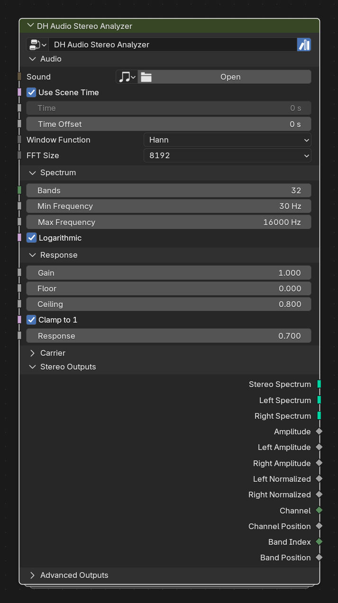

# DH Audio Stereo Analyzer

**Category:** Analysis 
**Blender domain:** GeometryNodeTree 
**Default node width:** 350 px

Analyze left and right channels with one field-driven Sample Sound Frequencies node. Outputs combined and separate carriers with standard, channel, and paired L/R attributes.

## Agent notes

- Use this when left and right channels need different behavior. Feed its separate outputs to Stereo Points or mono-compatible consumers.
- The combined Stereo Spectrum contains two carrier rows; it is not a single mono row.

## Key choices

- **Window Function** and **FFT Size** use Blender 5.2's native Sample Sound Frequencies menus; their defaults are Hann and 8192.

## Interface panels

- **Audio**: open by default; Required Sound, time, and FFT controls for stereo channel analysis
- **Spectrum**: open by default; Frequency distribution shared by both channels
- **Response**: open by default; Response shaping shared by both channels
- **Carrier**: collapsed by default; Raw carrier spacing; usually leave collapsed
- **Stereo Outputs**: open by default; Combined and separated channel carriers plus common stereo fields
- **Advanced Outputs**: collapsed by default; Raw channel values and frequency metadata

## Inputs

| Panel | Socket | Type | Default | Description |
| --- | --- | --- | --- | --- |
| Audio | **Sound** | NodeSocketSound | none | Required: Sound data-block to analyze. An unassigned Sound produces zero amplitude, which is indistinguishable from silent audio inside Geometry Nodes |
| Audio | **Use Scene Time** | NodeSocketBool | on | Use Scene Time. Disable to use the custom Time input |
| Audio | **Time** | NodeSocketFloat | 0 | Custom time in seconds when Use Scene Time is disabled |
| Audio | **Time Offset** | NodeSocketFloat | 0 | Seconds added to the selected time source |
| Audio | **Window Function** | NodeSocketMenu | Hann | FFT window function |
| Audio | **FFT Size** | NodeSocketMenu | 8192 | FFT analysis size. Higher values improve frequency resolution but reduce time resolution |
| Spectrum | **Bands** | NodeSocketInt | 32 | none |
| Spectrum | **Min Frequency** | NodeSocketFloat | 30 | none |
| Spectrum | **Max Frequency** | NodeSocketFloat | 1.6e+04 | none |
| Spectrum | **Logarithmic** | NodeSocketBool | on | none |
| Response | **Gain** | NodeSocketFloat | 1 | Multiplier applied before normalization |
| Response | **Floor** | NodeSocketFloat | 0 | Post-gain amplitude mapped to zero |
| Response | **Ceiling** | NodeSocketFloat | 0.8 | Post-gain amplitude mapped to one |
| Response | **Clamp to 1** | NodeSocketBool | on | Clamp normalized amplitude to a maximum of one |
| Response | **Response** | NodeSocketFloat | 0.7 | Power curve. Below 1 emphasizes quieter values; above 1 emphasizes peaks |
| Carrier | **Spacing** | NodeSocketFloat | 1 | X spacing between bands |
| Carrier | **Channel Spacing** | NodeSocketFloat | 1 | Y separation between the raw Left and Right carrier rows |

## Outputs

| Panel | Socket | Type | Default | Description |
| --- | --- | --- | --- | --- |
| Stereo Outputs | **Stereo Spectrum** | NodeSocketGeometry | none | Combined Left and Right carriers; two independent edge rows |
| Stereo Outputs | **Left Spectrum** | NodeSocketGeometry | none | Left-channel carrier compatible with mono spectrum consumers |
| Stereo Outputs | **Right Spectrum** | NodeSocketGeometry | none | Right-channel carrier compatible with mono spectrum consumers |
| Stereo Outputs | **Amplitude** | NodeSocketFloat | 0 | none |
| Stereo Outputs | **Left Amplitude** | NodeSocketFloat | 0 | none |
| Stereo Outputs | **Right Amplitude** | NodeSocketFloat | 0 | none |
| Stereo Outputs | **Left Normalized** | NodeSocketFloat | 0 | none |
| Stereo Outputs | **Right Normalized** | NodeSocketFloat | 0 | none |
| Stereo Outputs | **Channel** | NodeSocketInt | 0 | none |
| Stereo Outputs | **Channel Position** | NodeSocketFloat | 0 | none |
| Stereo Outputs | **Band Index** | NodeSocketInt | 0 | none |
| Stereo Outputs | **Band Position** | NodeSocketFloat | 0 | none |
| Advanced Outputs | **Raw Amplitude** | NodeSocketFloat | 0 | none |
| Advanced Outputs | **Left Raw Amplitude** | NodeSocketFloat | 0 | none |
| Advanced Outputs | **Right Raw Amplitude** | NodeSocketFloat | 0 | none |
| Advanced Outputs | **Low Frequency** | NodeSocketFloat | 0 | none |
| Advanced Outputs | **Center Frequency** | NodeSocketFloat | 0 | none |
| Advanced Outputs | **High Frequency** | NodeSocketFloat | 0 | none |
| Advanced Outputs | **Bandwidth** | NodeSocketFloat | 0 | none |

## Verification source

This page was generated from the public Blender interface exported by
tools/export_public_node_interfaces.py against a fresh toolkit build. Update
the screenshot and regenerate this page whenever the public interface changes.
