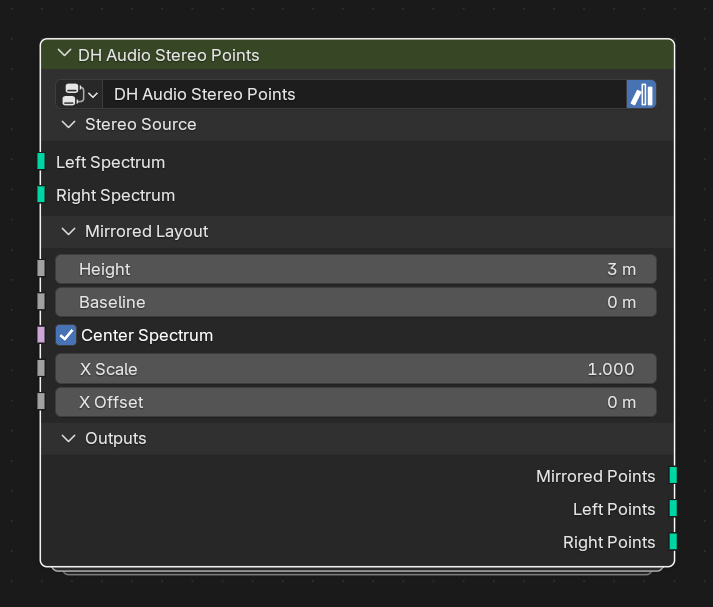

# DH Audio Stereo Points

**Category:** Mapping 
**Blender domain:** GeometryNodeTree 
**Default node width:** 315 px

Map Stereo Analyzer Left and Right carriers into mirrored point rows around a shared baseline. Separate outputs remain compatible with Spectrum Curve, Fill, and History.

## Agent notes

- It mirrors left and right around a shared baseline and preserves separate outputs for downstream consumers.
- Feed one channel at a time to mono-only consumers, or keep the combined result for a mirrored display.

## Interface panels

- **Stereo Source**: open by default; Separate channel carriers from DH Audio Stereo Analyzer
- **Mirrored Layout**: open by default; Left rises above the baseline; Right mirrors below it
- **Outputs**: open by default; Combined or separate mirrored point rows

## Inputs

| Panel | Socket | Type | Default | Description |
| --- | --- | --- | --- | --- |
| Stereo Source | **Left Spectrum** | NodeSocketGeometry | none | DH Audio Stereo Analyzer Left Spectrum output |
| Stereo Source | **Right Spectrum** | NodeSocketGeometry | none | DH Audio Stereo Analyzer Right Spectrum output |
| Mirrored Layout | **Height** | NodeSocketFloat | 3 | Maximum distance from the shared baseline |
| Mirrored Layout | **Baseline** | NodeSocketFloat | 0 | Mirror axis in Z |
| Mirrored Layout | **Center Spectrum** | NodeSocketBool | on | none |
| Mirrored Layout | **X Scale** | NodeSocketFloat | 1 | none |
| Mirrored Layout | **X Offset** | NodeSocketFloat | 0 | none |

## Outputs

| Panel | Socket | Type | Default | Description |
| --- | --- | --- | --- | --- |
| Outputs | **Mirrored Points** | NodeSocketGeometry | none | Joined Left-above and Right-below point rows with separate edges |
| Outputs | **Left Points** | NodeSocketGeometry | none | Positive-height Left row; safe for Curve, Fill, or History |
| Outputs | **Right Points** | NodeSocketGeometry | none | Negative-height Right row; safe for Curve, Fill, or History |

## Verification source

This page was generated from the public Blender interface exported by
tools/export_public_node_interfaces.py against a fresh toolkit build. Update
the screenshot and regenerate this page whenever the public interface changes.
